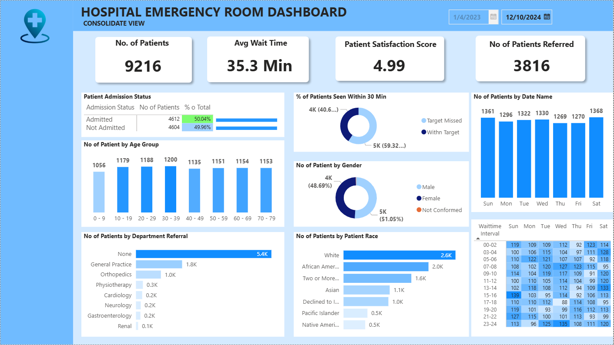
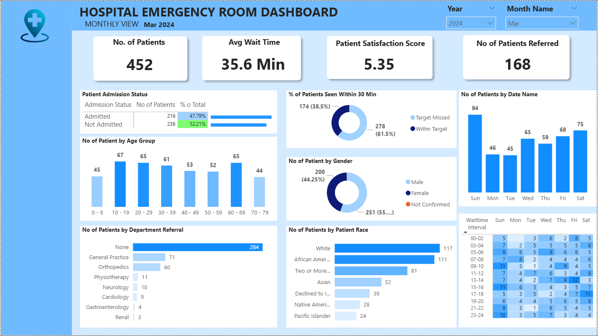
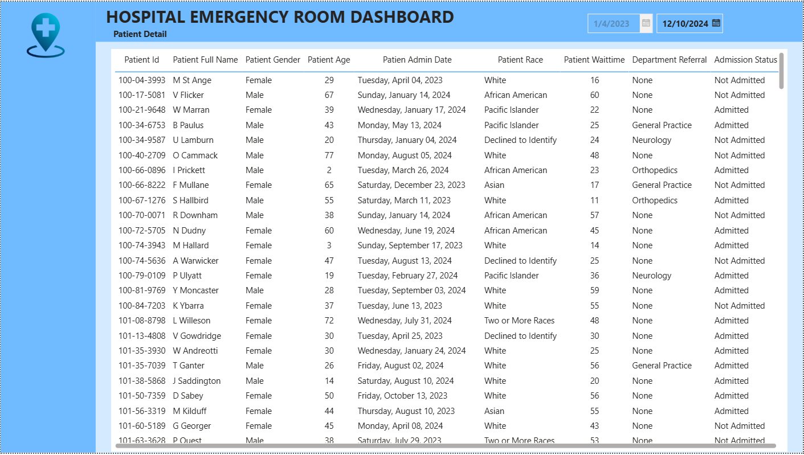

# Hospital_Emergency_Project

## Bối cảnh doanh nghiệp

Biến dữ liệu thô của phòng cấp cứu bệnh viện thành thông tin chi tiết có thể hành động được, giúp các bên liên quan theo dõi hiệu suất, xác định xu hướng, phát hiện các lĩnh vực cần cải thiện và đưa ra quyết định sáng suốt để tối ưu hóa quy trình và nâng cao chất lượng dịch vụ

## Dashboard

### Chế độ xem tổng hợp (Consolidated View)

### Chế độ xem hàng tháng (Monthly View)

### Chi tiết bệnh nhân (Patient View) 

## Đọc dữ liệu 

+ **Dữ liệu xuất phát từ tháng 4 năm 2023 đến tháng 10 năm 2024 ( gồm 19 tháng, với tổng số dòng dữ liệu là 9,216 dòng) **

  + Thời gian bệnh nhân đợi và độ hài lòng:

     + Thời gian chờ của bệnh nhân rơi vào khoảng 35,3 phút - điều này không thực sự tốt (thời gian chờ lý tưởng xây dựng là 30 phút), cần có biện pháp để giảm thời gian chờ này lại. Đồng thời mức độ hài lòng của khách hàng cũng thấp chỉ đạt khoảng 4.99/10, lý do một phần đến từ thời gian chờ quá

  + Chuyển sang các bệnh viện khách

     + Số lượng bệnh nhân không được chuyển việc là 5400 bệnh nhân, con số thật sự tốt. Đối với các bệnh viện chuyển đi tập trung vào khu vực khám tổng quát với 1840 ca và phòng chấn thương chỉnh hình 995 ca
   
  + Thời gian bận rộn và cao điểm

     + Thứ bảy là ngày có số bệnh nhân nhiều nhất với 1368 bệnh nhân, sau đó đến chủ nhật với 1361 bệnh nhân. Giờ cao điểm tập trung vào 11h trưa, 7h tối, 1h, cần bố trí nhân lực vào 3 khung thời gian này
 
  + Nhân khẩu học bệnh nhân

     + Bệnh nhân tập trung vào nhóm tuổi từ 30 - 39 tuổi với 1200 người, tiếp theo là độ tuổi từ 20 - 29 tuổi với 1188 tuổi
   
     + Tập trung chủ yếu là người da trắng với 2571 người, người Mỹ gốc phi rơi vào khoảng 1951 người
   

